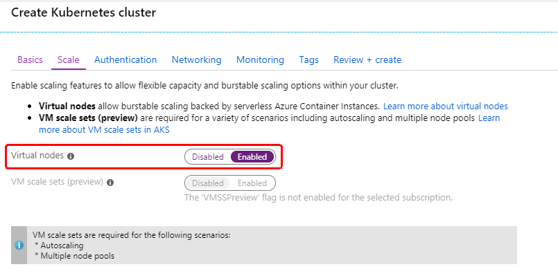
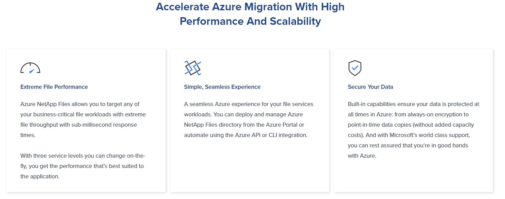
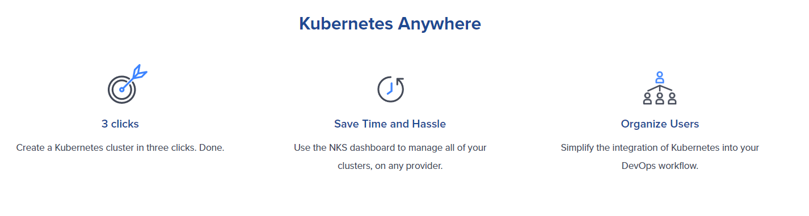

class: middle, background-image
### Recap of de:code 2019

---
exclude: true
### whoami

.left-small[
    
]

.right-large[
- Kyohei Mizumoto(@kyohmizu)

- C# Software Engineer

- Interests
    - Docker/Kubernetes
    - Go
    - Security
]

---
### de:code 2019

.zoom2[
<u><https://www.microsoft.com/ja-jp/events/decode/2019/default.aspx></u>
]

- The technical conference for all IT engineers hosted by Microsoft

- Held on 29th, 30th May

---
### What I was interested in

- Windows Containers

- Virtual Kubelet

- Kubernetes-based Event-driven Autoscaling(KEDA)

- NetApp Services

---
class: middle, background-image
### Windows Containers

---
### Windows Containers on k8s

.zoom2[
<u><https://cloudblogs.microsoft.com/opensource/2019/03/25/windows-server-containers-now-supported-kubernetes/></u>

Single Kubernetes cluster can have both Linux nodes and Windows Server nodes
]

<center></center>

---
### Windows Containers on AKS

.zoom2[
<u><https://docs.microsoft.com/en-us/azure/aks/windows-container-cli></u>
]

- Preview feature

- Multiple nood pools

- You need to:

  - Install aks-preview CLI extension

  - Add a Windows Server node pool

---
class: middle, background-image
### Virtual Kubelet

---
### Virtual Kubelet

<u><https://github.com/Virtual-Kubelet/Virtual-Kubelet></u>

"Kubernetes API on top, programmable back."

- Allows the nodes to be backed by other services  
  (ACI, AWS Fargate, IoT Edge etc)

- Enable the extension of the k8s API into serverless container platforms

- Denoted to CNCF from Microsoft

---
### How It Works

<center></center>

---
### Providers

- Alibaba Cloud ECI Provider

- <font color="Red">Azure Container Instances Provider</font>

- AWS Fargate Provider

- HashiCorp Nomad Provider

- OpenStack Zun Provider

- (Adding a New Provider via the Provider Interface)

---
class: header-margin
### Virtual Nodes on Azure Portal

<center></center>

---
### Virtual Nodes on Azure Portal

- ACI is added in AKS

```bash
$ kubectl get node
NAME                       STATUS   ROLES   AGE  --
aks-agentpool-20139558-0   Ready    agent   19m  
aks-agentpool-20139558-1   Ready    agent   19m  
virtual-node-aci-linux     Ready    agent   17m  
```

---
class: middle, background-image
### KEDA

---


<u><https://github.com/kedacore/keda></u>

- Kubernetes-based Event-driven Autoscaling

- 0-1 autoscaling

- Run on both the Cloud and the Edge

<center></center>

---
### How It Works

<center></center>

---
### How It Works

KEDA acts as:

- an agent to activate and deactivate a deployment to scale to/from zero on no events

- a Kubernetes metrics server to expose rich event data to the HPA to drive scale out

---
class: middle, background-image
### NetApp Services

---
### Azure NetApp Files

.zoom2[
<u><https://cloud.netapp.com/azure-netapp-files/></u>

<u><https://docs.microsoft.com/en-us/azure/azure-netapp-files/></u>
]

<center></center>

---
### NetApp Kubernetes Service

<u><https://cloud.netapp.com/kubernetes-service></u>

<center></center>

---
class: middle, background-image
## Demo

---
### Vertual Kubelet with AKS

<u><https://docs.microsoft.com/en-us/azure/aks/virtual-kubelet></u>

- Install vertual kubelet(Windows + Linux)

- Deploy Pods on vertual kubelet nodes

---
### Before You Begin

- Register Container Instances feature provider

- Initialize Helm

  - Service account for RBAC-enabled clusters

```bash
$ helm init --service-account tiller
```

---
### Install

```bash
$az aks install-connector \
    --resource-group myResourceGroup \
    --name myAKSCluster \
    --connector-name virtual-kubelet \
    --os-type Both
```

---
### Validate Vertual Kubelet

- 1 node + 2 virtual kubelet nodes

.zoom2[
```bash
$ kubectl get node
NAME                                                STATUS   --
aks-agentpool-20139558-0                            Ready   
virtual-kubelet-virtual-kubelet-linux-japaneast     Ready   
virtual-kubelet-virtual-kubelet-windows-japaneast   Ready   
```
]

---
### Deploy on Vertual Kubelet

- Pods for virtual kubelet are deployed on the normal node

.zoom1[
```bash
$ kubectl get po -o wide
NAME                                                               
READY   STATUS    RESTARTS   AGE   IP            NODE                --    
pod/virtual-kubelet-linux-japaneast-virtual-kubelet-for-aks-87rd2m5
1/1     Running   0          17m   10.244.0.14   aks-agentpool-20139558-0
pod/virtual-kubelet-windows-japaneast-virtual-kubelet-for-aks-9fzw5
1/1     Running   0          17m   10.244.0.15   aks-agentpool-20139558-0
```
]

---
### Run Linux Container

.zoom0[
```yaml
apiVersion: apps/v1
kind: Deployment
metadata:
  name: aci-helloworld
spec:
  replicas: 1
  selector:
    matchLabels:
      app: aci-helloworld
  template:
    metadata:
      labels:
        app: aci-helloworld
    spec:
      containers:
      - name: aci-helloworld
        image: microsoft/aci-helloworld
        ports:
        - containerPort: 80
      nodeSelector:
        beta.kubernetes.io/os: linux
        kubernetes.io/role: agent
        type: virtual-kubelet
      tolerations:
      - key: virtual-kubelet.io/provider
        operator: Equal
        value: azure
        effect: NoSchedule
```
]

---
### Run Linux Container

- The pod is running on the linux virtual kubelet node

.zoom2[
```bash
$ kubectl apply -f vk-linux.yaml
deployment.apps/aci-helloworld created

$ kubectl get po -o wide
NAME                             READY   STATUS    RESTARTS   AGE
IP              NODE                                           --
aci-helloworld-657c97d89b-7lnpm  1/1     Running   0          65s
40.81.220.187   virtual-kubelet-virtual-kubelet-linux-japaneast  
```
]

---
### Run Windows Container

.zoom0[
```yaml
apiVersion: apps/v1
kind: Deployment
metadata:
  name: nanoserver-iis
spec:
  replicas: 1
  selector:
    matchLabels:
      app: nanoserver-iis
  template:
    metadata:
      labels:
        app: nanoserver-iis
    spec:
      containers:
      - name: nanoserver-iis
        image: microsoft/iis:nanoserver
        ports:
        - containerPort: 80
      nodeSelector:
        beta.kubernetes.io/os: windows
        kubernetes.io/role: agent
        type: virtual-kubelet
      tolerations:
      - key: virtual-kubelet.io/provider
        operator: Equal
        value: azure
        effect: NoSchedule
```
]

---
### Run Windows Container

- The pod is running on the windows virtual kubelet node

.zoom2[
```bash
$ kubectl apply -f vk-windows.yaml
deployment.apps/nanoserver-iis created

$ kubectl get po -o wide
NAME                              READY   STATUS    RESTARTS  AGE
IP              NODE                                           --
nanoserver-iis-6465dc649f-v7q2x   1/1     Running   0         53s
20.43.88.185    virtual-kubelet-virtual-kubelet-windows-japaneast 
```
]

---
class: middle, background-image
## Thank you!
